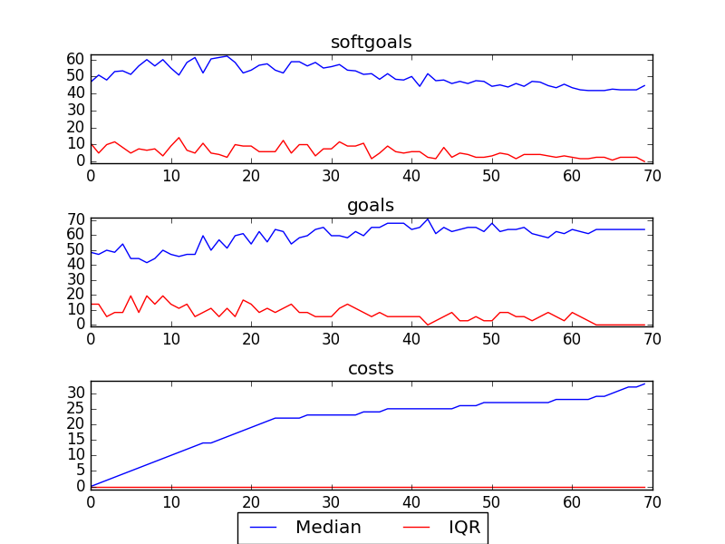

## CSCounsellingManagement
```

rank ,         name ,    med   ,   iqr 
----------------------------------------------------
   1 ,      gen0_f1 ,     40.0  ,    7.0 (-------       *|-             ),27.00, 34.00, 41.00, 41.00, 43.00
   1 ,      gen2_f1 ,     44.0  ,    2.0 (          -----|-  *--        ),37.00, 43.00, 45.00, 45.00, 48.00
   2 ,      gen4_f1 ,     49.0  ,    3.0 (               |   --   *     ),45.00, 47.00, 50.00, 51.00, 51.00
   3 ,      gen6_f1 ,     51.0  ,    2.0 (               |     ---  *-  ),47.00, 50.00, 52.00, 53.00, 54.00
   3 ,      gen8_f1 ,     52.0  ,    2.0 (               |        -  *- ),50.00, 51.00, 53.00, 54.00, 55.00
   3 ,     gen10_f1 ,     52.0  ,    2.0 (               |        --  * ),50.00, 52.00, 54.00, 55.00, 55.00

rank ,         name ,    med   ,   iqr 
----------------------------------------------------
   1 ,      gen0_f2 ,     14.0  ,    5.0 (               |*      ---    ),14.00, 14.00, 19.00, 21.00, 22.00
   1 ,      gen2_f2 ,     19.0  ,    3.0 (------         |*             ),14.00, 16.00, 19.00, 22.00, 22.00
   1 ,      gen4_f2 ,     19.0  ,    4.0 (      -------  |          *-- ),16.00, 18.00, 22.00, 22.00, 23.00
   2 ,      gen6_f2 ,     21.0  ,    4.0 (               |             *),19.00, 19.00, 23.00, 23.00, 23.00
   2 ,      gen8_f2 ,     22.0  ,    2.0 (               |             *),21.00, 21.00, 23.00, 23.00, 23.00
   2 ,     gen10_f2 ,     22.0  ,    1.0 (               |       ---   *),21.00, 22.00, 23.00, 23.00, 23.00
```

### Time Taken : 10.5718798637


### Decisions Ranked
```
+------+--------------------------------------------------------------------+----------+-------+------+---------+
| rank |                                name                                |   type   | value | cost | support |
+------+--------------------------------------------------------------------+----------+-------+------+---------+
|  1   |        Write Yearly Peformance Evaluations for Counsellors         |   task   |   1   |  1   | 0.00601 |
|  2   |         Three Months of Review Be Given to New Counsellors         |   goal   |   1   |  1   | 0.00601 |
|  3   |               Create Call Classification Catagories                |   task   |   1   |  1   | 0.00569 |
|  4   |    Clear Communication About the Purpose of IT [to Counselors]     | softgoal |   1   |  1   | 0.00541 |
|  5   |                          Double Head Set                           | resource |   1   |  1   | 0.00515 |
|  6   |          Increase Comfortableness [with Learning Process]          | softgoal |   1   |  1   | 0.00491 |
|  7   |                     !Hire Counselling Managers                     |   task   |   1   |  1   | 0.00491 |
|  8   |               Reduce Spending on Employees Salaries                | softgoal |   1   |  1   | 0.00491 |
|  9   |                      Set Counselling Policies                      |   task   |   1   |  1   | 0.00491 |
|  10  |                   Put on Web Moderator Meetings                    |   task   |   1   |  1   |  0.0045 |
|  11  |        Support Day to Day on the Floor Needs of Counsellors        | softgoal |   1   |  1   |  0.0045 |
|  12  |                  Professional Counsellors Be Used                  |   goal   |   1   |  1   | 0.00432 |
|  13  |             Provide One-on-One Support to Counsellors              |   task   |   1   |  1   | 0.00432 |
|  14  |                Feedback to Counsellors Be Provided                 |   goal   |   1   |  1   | 0.00416 |
|  15  |                            Review Tape                             |   task   |   -1  |  1   | 0.00416 |
|  16  |              !Improve Job Descriptions [Counsellors]               | softgoal |   1   |  1   |  0.004  |
|  17  |                   !A Training Program Be Present                   |   goal   |   1   |  1   |  0.004  |
|  18  |                    !A Training Room Be Present                     |   goal   |   1   |  1   | 0.00386 |
|  19  |                           Request Shifts                           |   task   |   1   |  1   | 0.00386 |
|  20  |                  Historical Data of Call Volumes                   | resource |   1   |  1   | 0.00373 |
|  21  |                  Rigorous [Employee Evaluations]                   | softgoal |   1   |  1   | 0.00349 |
|  22  |             Put on Orientation Process for Cousellors              |   task   |   1   |  1   | 0.00328 |
|  23  |                   Bilingual Counsellors Be Hired                   |   goal   |   1   |  1   | 0.00309 |
|  24  |                       Counselling Resources                        | resource |   -1  |  1   |  0.003  |
|  25  |                !Calls Be Recorded into a Data Base1                |   goal   |   -1  |  1   | 0.00292 |
|  26  |             Communicate CS Information to Counsellors              |   task   |   -1  |  1   | 0.00292 |
|  27  |                       Contracts Be Reviewed                        |   goal   |   1   |  1   | 0.00292 |
|  28  |                Acquire Web Training from Operations                |   task   |   -1  |  1   | 0.00292 |
|  29  |                     Positive Internal Opinion                      | softgoal |   -1  |  1   | 0.00292 |
|  30  |                         Debrief Web Posts                          |   task   |   -1  |  1   | 0.00292 |
|  31  |                      Happiness [Counsellors]1                      | softgoal |   -1  |  1   | 0.00292 |
|  32  |               Improved Writing Skills [Counsellors]                | softgoal |   -1  |  1   | 0.00292 |
|  33  |   Perform Counselling as Instructed By Supervisor [Counsellors]    | softgoal |   -1  |  1   | 0.00292 |
|  34  |                     !An IT Trainer Be Present1                     |   goal   |   1   |  1   | 0.00292 |
|  35  |                  Increased Counselling Resources                   | softgoal |   -1  |  1   | 0.00292 |
|  36  |                   Consider Counsellors Feedback                    | softgoal |   -1  |  1   | 0.00292 |
|  37  |            Counsellors Pass Probation within Six Months            |   goal   |   1   |  1   | 0.00292 |
|  38  |                     Avoid Liability Problems1                      | softgoal |   -1  |  1   | 0.00292 |
|  39  |                        Improve [IT Skills]                         | softgoal |   -1  |  1   | 0.00292 |
|  40  |                   Increase Funding for Training                    | softgoal |   -1  |  1   | 0.00292 |
|  41  |                Support Analysis [Counsellors Time]1                | softgoal |   -1  |  1   | 0.00292 |
|  42  |                  Negotiate with Counsellors Union                  |   task   |   -1  |  1   | 0.00292 |
|  43  |     !Performance Review Information Be Collected in Data Base1     |   goal   |   -1  |  1   | 0.00292 |
|  44  |              Increase IT Methods to Acquire Feedback               | softgoal |   -1  |  1   | 0.00292 |
|  45  |                     *High Quality Counselling2                     | softgoal |   -1  |  1   | 0.00292 |
|  46  |                        Policies Be Reviewed                        |   goal   |   1   |  1   | 0.00292 |
|  47  |         Pressure Counsellors [to Provide Online Services]          | softgoal |   -1  |  1   | 0.00292 |
|  48  |                  !A Training Computer Be Present1                  |   goal   |   -1  |  1   | 0.00292 |
|  49  |                  Counselling Policies Be Followed                  |   goal   |   1   |  1   | 0.00292 |
|  50  |            Avoid Relationships with Specific Counsellor            | softgoal |   -1  |  1   | 0.00292 |
|  51  |                      Analyze Staffing Levels                       |   goal   |   -1  |  1   | 0.00292 |
|  52  |                           Debrief Calls                            |   task   |   -1  |  1   | 0.00292 |
|  53  |                       Analyze Service Levels                       |   goal   |   -1  |  1   | 0.00292 |
|  54  |                   Professional Work Environment1                   | softgoal |   -1  |  1   | 0.00292 |
|  55  |              Holes in Operations Managing Be Removed               |   goal   |   -1  |  1   | 0.00292 |
|  56  |          Facilitate Faster Changes in Counsellor Duties1           | softgoal |   -1  |  1   | 0.00292 |
|  57  |                 Improve [Call Recording Equipment]                 | softgoal |   -1  |  1   | 0.00292 |
|  58  |               Full Time Night Complement Be Acquired               |   goal   |   1   |  1   | 0.00292 |
|  59  |                        Counsellors Be Paid                         |   task   |   -1  |  1   | 0.00292 |
|  60  |              *Increase [IT Training for Counsellors]               | softgoal |   -1  |  1   | 0.00292 |
|  61  |               Clearer Call Classification Catagories               | softgoal |   -1  |  1   | 0.00292 |
|  62  |          Supervision Be Performed At Least Every 3 Months          |   goal   |   -1  |  1   | 0.00292 |
|  63  | Technology Be Used to Ensure Counsellors are Keeping Correct Hours |   goal   |   1   |  1   | 0.00292 |
|  64  |                          Use Blue Pumpkin                          |   task   |   -1  |  1   | 0.00292 |
|  65  |                         !Hire Counsellors                          |   task   |   1   |  1   | 0.00225 |
|  66  |                    Put On Counselling Workshops                    |   task   |   1   |  1   | 0.00193 |
|  67  |                     Attend Part Time Meetings                      |   task   |   1   |  1   | 0.00193 |
|  68  |         Increase Counsellors Experience [with Technology]          | softgoal |   -1  |  1   |  0.0018 |
|  69  |    !Increased Emphasis on IT in Hiring Process [of Counsellors]    | softgoal |   1   |  1   |  0.0018 |
|  70  |                          Call Statistics                           | resource |   -1  |  1   | 0.00159 |
+------+--------------------------------------------------------------------+----------+-------+------+---------+
```
