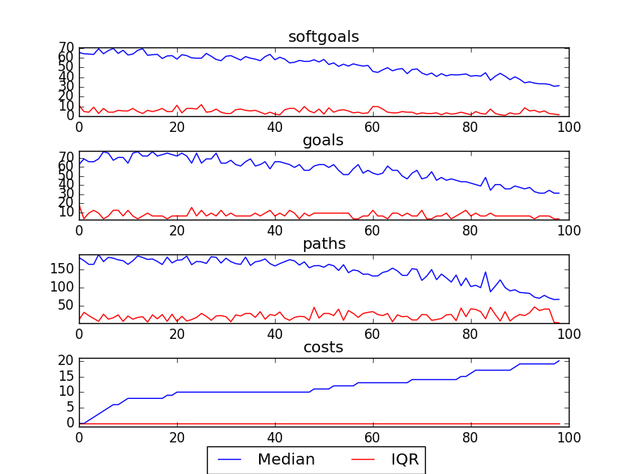
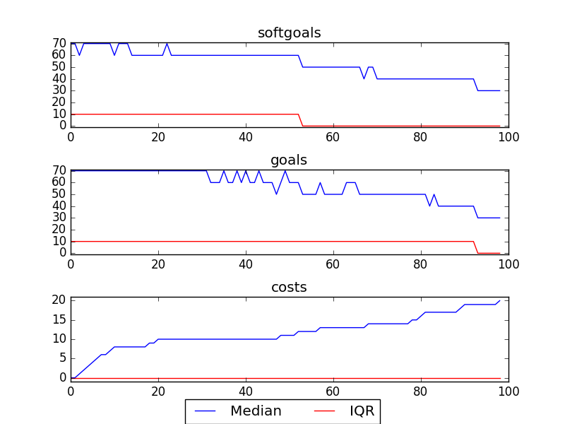

## CSFDandMarketing
```

rank ,         name ,    med   ,   iqr 
----------------------------------------------------
   1 ,      gen0_f1 ,    27.27  ,   4.55 (               |          *-- ),27.27, 27.27, 31.82, 31.82, 32.47
   1 ,      gen2_f1 ,    31.82  ,    0.0 (---------------|----------*-- ),27.27, 31.82, 31.82, 31.82, 32.47
   2 ,      gen4_f1 ,    32.47  ,   0.65 (               |             *),31.82, 31.82, 32.47, 32.47, 32.47
   2 ,      gen6_f1 ,    32.47  ,    0.0 (               |             *),32.47, 32.47, 32.47, 32.47, 32.47
   2 ,      gen8_f1 ,    32.47  ,    0.0 (               |             *),32.47, 32.47, 32.47, 32.47, 32.47
   2 ,     gen10_f1 ,    32.47  ,    0.0 (               |             *),32.47, 32.47, 32.47, 32.47, 32.47

rank ,         name ,    med   ,   iqr 
----------------------------------------------------
   1 ,      gen0_f2 ,    28.13  ,   3.13 (          *    |   ---------- ),25.00, 25.00, 28.13, 31.25, 34.38
   1 ,      gen2_f2 ,    28.13  ,   3.12 (               |   *--------- ),28.13, 28.13, 31.25, 31.25, 34.38
   2 ,      gen4_f2 ,    31.25  ,   3.13 (          -----|---          *),28.13, 31.25, 34.38, 34.38, 34.38
   2 ,      gen6_f2 ,    34.38  ,    0.0 (               |   ----------*),31.25, 34.38, 34.38, 34.38, 34.38
   2 ,      gen8_f2 ,    34.38  ,    0.0 (               |             *),34.38, 34.38, 34.38, 34.38, 34.38
   2 ,     gen10_f2 ,    34.38  ,    0.0 (               |             *),34.38, 34.38, 34.38, 34.38, 34.38
```

### Smoothened Plot


### Decisions Ranked
```
+------+--------------------------------------------------------------------------+----------+-------+------+---------+
| rank |                                   name                                   |   type   | value | cost | support |
+------+--------------------------------------------------------------------------+----------+-------+------+---------+
|  1   |                              Pledge\nonline                              |   task   |   -1  |  1   | 0.01053 |
|  2   |                      ! Provide compiled call data                        |   task   |   1   |  1   | 0.00526 |
|  3   |                            Get donor database                            |   task   |   1   |  1   | 0.00526 |
|  4   |                          Create Thank you ads                            |   task   |   1   |  1   | 0.00478 |
|  5   |                  Single charitable registration number1                  | resource |   1   |  1   | 0.00439 |
|  6   |                       Give philanthropic donation                        |   task   |   1   |  1   | 0.00405 |
|  7   |                   Answers be provided to media queries                   |   goal   |   1   |  1   | 0.00405 |
|  8   |                        Sponsor partner\ncontacts2                        | softgoal |   -1  |  1   | 0.00351 |
|  9   |                         Send recognition letters                         |   task   |   1   |  1   | 0.00351 |
|  10  |                           Pledge\nDuring event                           |   task   |   1   |  1   | 0.00351 |
|  11  |                        Donor/Accounting Database                         | resource |   -1  |  1   |  0.0031 |
|  12  |                     Provide Online Donor Technology                      |   task   |   -1  |  1   | 0.00277 |
|  13  |          Bring Regional Fundraising Staff Together Once a Year           |   task   |   -1  |  1   | 0.00277 |
|  14  |                               CS\nServices                               | softgoal |   -1  |  1   | 0.00277 |
|  15  |                       Accountability of services1                        | softgoal |   -1  |  1   | 0.00277 |
|  16  |           Provide Promotional Material to Student Ambassadors            |   task   |   -1  |  1   | 0.00277 |
|  17  |                                CS Stories                                | softgoal |   -1  |  1   | 0.00277 |
|  18  |                          Conflicts Be Managed                            |   task   |   1   |  1   | 0.00277 |
|  19  |                          Use volunteer services                          |   task   |   -1  |  1   | 0.00277 |
|  20  |                Pay Fund Development and Marketing Staff                  |   task   |   1   |  1   | 0.00277 |
|  21  |                           Manage Receivables                             |   task   |   -1  |  1   | 0.00277 |
|  22  |                             Reach agreement                              |   task   |   -1  |  1   | 0.00277 |
|  23  |                        Get web event technology1                         |   task   |   -1  |  1   | 0.00277 |
|  24  |                       ! Provide money for services                       |   task   |   -1  |  1   | 0.00277 |
|  25  |            Create posters, flyers and informational material             |   task   |   -1  |  1   | 0.00277 |
|  26  |                     Provide Document Library System                      |   task   |   -1  |  1   | 0.00277 |
|  27  |                          Presentation Skills 1                           | softgoal |   -1  |  1   | 0.00277 |
|  28  |                         Create branded products                          |   task   |   -1  |  1   | 0.00277 |
|  29  |                        Run Fundraiser in Schools                         |   task   |   -1  |  1   | 0.00277 |
|  30  |                           Reallocate resources                           |   task   |   -1  |  1   | 0.00277 |
|  31  |              Not for Profit Partners Be Involved in Events               |   goal   |   -1  |  1   | 0.00277 |
|  32  |                      Elaborate Fundraising targets1                      |   task   |   -1  |  1   | 0.00277 |
|  33  |                          Give CS Presentations                           |   task   |   -1  |  1   | 0.00277 |
|  34  |                           Speak at Fundraisers                           |   task   |   -1  |  1   | 0.00277 |
|  35  |                       Inform Sponsors of Progress                        |   task   |   -1  |  1   | 0.00277 |
|  36  |                            Free advertisement                            | resource |   -1  |  1   | 0.00277 |
|  37  |                     Implement Stay in Touch program                      |   task   |   -1  |  1   | 0.00277 |
|  38  |                         Credibility [CS Brand] 1                         | softgoal |   -1  |  1   | 0.00277 |
|  39  |                          Reallocate resources1                           |   task   |   -1  |  1   | 0.00277 |
|  40  |   Put on Orientation Process for Fund Development and Marketing Staff    |   task   |   -1  |  1   | 0.00277 |
|  41  |                    Organize discussions with Sponsors                    |   task   |   -1  |  1   | 0.00277 |
|  42  |                       National Marketing Strategy                        | resource |   -1  |  1   | 0.00277 |
|  43  |                           Increase Volunteers1                           | softgoal |   -1  |  1   | 0.00277 |
|  44  |                        Collect donor information                         |   task   |   -1  |  1   | 0.00277 |
|  45  |                      ! Write Articles for Website 1                      |   task   |   -1  |  1   | 0.00277 |
|  46  |                          Provide free services                           |   task   |   -1  |  1   | 0.00277 |
|  47  |         Engagement [Sponsor Employees in Promoting Awareness] 1          | softgoal |   -1  |  1   | 0.00277 |
|  48  |                Work with the Regions to Implement Events                 |   task   |   1   |  1   | 0.00277 |
|  49  |                        Project Management Skills                         | softgoal |   -1  |  1   | 0.00277 |
|  50  |                        Positive Internal Opinion1                        | softgoal |   -1  |  1   | 0.00277 |
|  51  |                      Quick [Response to Sponsors]                        | softgoal |   -1  |  1   | 0.00277 |
|  52  |                            Provide Logo to CS                            |   task   |   1   |  1   | 0.00277 |
|  53  |                             Timely services                              | softgoal |   -1  |  1   | 0.00277 |
|  54  |                      Share PAP in Document Library                       |   task   |   -1  |  1   | 0.00277 |
|  55  |                Get Corporate Partner Information from DL1                |   task   |   -1  |  1   | 0.00277 |
|  56  |                           Retain [Sponsors] 2                            | softgoal |   -1  |  1   | 0.00277 |
|  57  |      Sponsors Include CS Logos and Descriptions on their Products        |   task   |   1   |  1   | 0.00277 |
|  58  |                       Bi-Weekly Conference Calls                         |   task   |   -1  |  1   | 0.00277 |
|  59  |                       Exclusive Brand and Logo use                       | resource |   -1  |  1   | 0.00277 |
|  60  |                           Quality [Services]                             | softgoal |   -1  |  1   | 0.00277 |
|  61  |             Involvement [Not For Profit Partners in Events]1             | softgoal |   -1  |  1   | 0.00277 |
|  62  |                         Create General Ledgers                           |   task   |   -1  |  1   | 0.00277 |
|  63  |                    Increased availability to sponsors                    | softgoal |   -1  |  1   | 0.00277 |
|  64  |                          Provide free services1                          |   task   |   -1  |  1   | 0.00277 |
|  65  |                   Follow Highest Ethical Guidelines 1                    | softgoal |   -1  |  1   | 0.00277 |
|  66  |                      Share PAP in Document Library1                      |   task   |   -1  |  1   | 0.00277 |
|  67  |                  Store donor transactions into database                  |   task   |   -1  |  1   | 0.00277 |
|  68  |                        Sponsor partner\ncontacts1                        | softgoal |   1   |  1   | 0.00277 |
|  69  |                   Responsible Usage [Sponsor Funds] 1                    | softgoal |   -1  |  1   | 0.00277 |
|  70  |                              Track budgets                               |   task   |   -1  |  1   | 0.00277 |
|  71  |      Email Corporate Partners Interesting and Relevant News Pieces       |   task   |   -1  |  1   | 0.00277 |
|  72  |                           [Increase] Awareness                           | softgoal |   -1  |  1   | 0.00277 |
|  73  |              Exclusive Relationships [Official Partners] 2               | softgoal |   -1  |  1   | 0.00277 |
|  74  |                    Timely provision of free services1                    | softgoal |   -1  |  1   | 0.00277 |
|  75  | Pitch to National Corporate Sponsors the Sponsorship of Regional Events  |   task   |   -1  |  1   | 0.00277 |
|  76  |                      Provide philanthropic donation                      |   task   |   -1  |  1   | 0.00277 |
|  77  |              Put Together Proposals for Corporate Sponsors               |   task   |   -1  |  1   | 0.00277 |
|  78  |                       *Engage employees in events                        | softgoal |   1   |  1   | 0.00277 |
|  79  |              ! Counselor Speak on Kids Issues in General 1               |   task   |   -1  |  1   | 0.00277 |
|  80  |                     Provide Real Time Tax Receipts                       |   task   |   1   |  1   | 0.00277 |
|  81  |                 Up to date corporate partner information                 | softgoal |   1   |  1   | 0.00277 |
|  82  |                    Put on orientation for volunteers                     |   task   |   -1  |  1   | 0.00277 |
|  83  |                Write Down Corporate Sponsors Objectives                  |   task   |   -1  |  1   | 0.00277 |
|  84  |                     Develop national event calendar                      |   task   |   -1  |  1   | 0.00277 |
|  85  |                             Manage Accounts                              |   task   |   -1  |  1   | 0.00277 |
|  86  |                    Create Life Long Volunteer Spirit                     | softgoal |   -1  |  1   | 0.00277 |
|  87  |                  Communicate through Internet and phone                  |   task   |   -1  |  1   | 0.00277 |
|  88  |                              Provide funds                               |   task   |   -1  |  1   | 0.00277 |
|  89  |              ! Services be provided for Kids Bullying Line               |   goal   |   1   |  1   | 0.00277 |
|  90  |                    Market [Only For Serious Issues]                      |   task   |   1   |  1   | 0.00277 |
|  91  |                     Experienced [marketing partners]                     | softgoal |   -1  |  1   | 0.00277 |
|  92  |                   !Train counselors on public speaking                   |   task   |   -1  |  1   | 0.00277 |
|  93  |                     ! Write Articles for Magazines 1                     |   task   |   -1  |  1   | 0.00277 |
|  94  |                  Store donor information into database                   |   task   |   -1  |  1   | 0.00277 |
|  95  |         *Engagement Student Ambassadors in promoting awareness1          | softgoal |   -1  |  1   | 0.00277 |
|  96  |                       Positive [Reputation of CS]                        | softgoal |   -1  |  1   | 0.00277 |
|  97  |                       Market through own channels                        |   task   |   -1  |  1   | 0.00277 |
|  98  |                       Get philanthropic donations                        |   task   |   1   |  1   | 0.00277 |
|  99  |                          Participate in events                           |   task   |   1   |  1   | 0.00277 |
+------+--------------------------------------------------------------------------+----------+-------+------+---------+
```

### Time Taken : 60.2585508823
