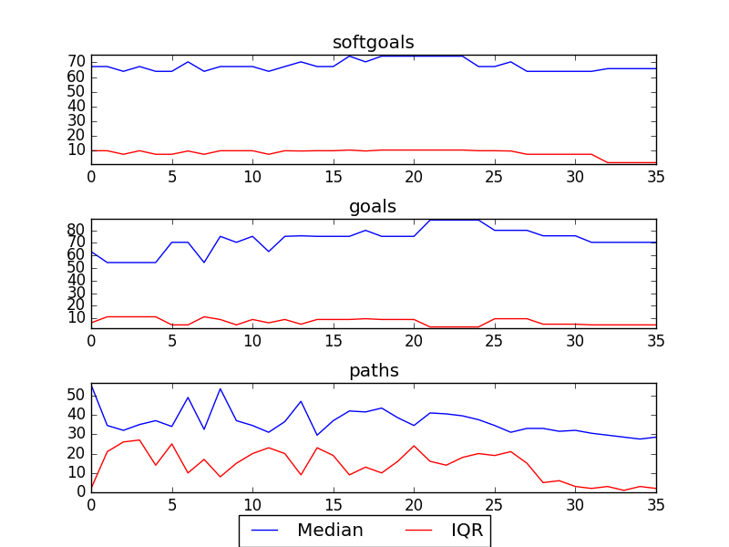

## CSITDepartment
```

rank ,         name ,    med   ,   iqr 
----------------------------------------------------
   1 ,      gen0_f1 ,    52.63  ,    7.9 (-------        |  *---        ),47.37, 52.63, 60.53, 60.53, 63.16
   1 ,      gen2_f1 ,    60.53  ,   5.27 (       ------- |      *---    ),52.63, 57.89, 63.16, 63.16, 65.79
   2 ,      gen4_f1 ,    63.16  ,   2.63 (              -|------    *   ),57.89, 63.16, 65.79, 65.79, 65.79
   2 ,      gen6_f1 ,    63.16  ,   2.63 (               |          *   ),63.16, 63.16, 65.79, 65.79, 65.79
   3 ,      gen8_f1 ,    68.42  ,   2.63 (               |      ----   *),63.16, 65.79, 68.42, 68.42, 68.42
   3 ,     gen10_f1 ,    68.42  ,   2.63 (               |      ----   *),63.16, 65.79, 68.42, 68.42, 68.42

rank ,         name ,    med   ,   iqr 
----------------------------------------------------
   1 ,      gen0_f2 ,    47.83  ,  13.05 (          *    |-------       ),34.78, 34.78, 47.83, 56.52, 65.22
   1 ,      gen2_f2 ,    56.52  ,  13.04 (      ----     |    *  ---    ),43.48, 47.83, 60.87, 65.22, 69.57
   2 ,      gen4_f2 ,    60.87  ,   4.35 (      ---------|----   *  --- ),43.48, 60.87, 65.22, 69.57, 73.91
   2 ,      gen6_f2 ,    69.57  ,   4.35 (             --|-------   *   ),52.17, 65.22, 69.57, 73.91, 73.91
   2 ,      gen8_f2 ,    69.57  ,   8.69 (               |             *),65.22, 65.22, 73.91, 73.91, 73.91
   2 ,     gen10_f2 ,    73.91  ,   8.69 (               |             *),65.22, 65.22, 73.91, 73.91, 73.91
```

### Smoothened Plot


### Decisions Ranked
```
+------+-------------------------------------------------------------+----------+-------+------+---------+
| rank |                             name                            |   type   | value | cost | support |
+------+-------------------------------------------------------------+----------+-------+------+---------+
|  1   |             !Calls Be Recorded into a Data Base1            |   goal   |   1   |  1   | 0.00993 |
|  2   |         *IT Providers have Knowledge of Counselling         |   goal   |   1   |  1   | 0.00922 |
|  3   |               *Implement Email for Counsellors              |   task   |   1   |  1   | 0.00806 |
|  4   |  *IT Providers have Knowledge of Fundraising and Marketing  |   goal   |   1   |  1   | 0.00645 |
|  5   |               !A Training Computer Be Present1              |   goal   |   1   |  1   | 0.00614 |
|  6   |         Consideration of Feedback [from Counsellors]        | softgoal |   1   |  1   | 0.00614 |
|  7   |                        Free Upgrades                        | resource |   1   |  1   | 0.00587 |
|  8   |                      Use Current Method                     |   task   |   1   |  1   | 0.00587 |
|  9   |                         Network PCs                         |   task   |   1   |  1   | 0.00561 |
|  10  |  !Performance Review Information Be Collected in Data Base1 |   goal   |   1   |  1   | 0.00561 |
|  11  |                           Use VPN                           |   task   |   -1  |  1   | 0.00538 |
|  12  |                  Put Content Onto Website1                  |   task   |   1   |  1   | 0.00516 |
|  13  |                            Use T1                           |   task   |   1   |  1   | 0.00516 |
|  14  |             Improve [Call Recording Equipment]1             | softgoal |   1   |  1   | 0.00496 |
|  15  |                  !An IT Trainer Be Present1                 |   goal   |   1   |  1   | 0.00496 |
|  16  |           Adequately Customizable [CS Technology]           | softgoal |   1   |  1   | 0.00496 |
|  17  |                     CS Be Not for Profit                    |   goal   |   1   |  1   |  0.0043 |
|  18  |          Easily Accessable Technology Instructions1         | softgoal |   1   |  1   | 0.00416 |
|  19  |                         IT Resources                        | resource |   -1  |  1   | 0.00416 |
|  20  |                            Oracle                           | resource |   -1  |  1   | 0.00416 |
|  21  |    Call Center Server and Scheduling System Be Integrated   |   goal   |   1   |  1   | 0.00416 |
|  22  |                       Free Web Server                       | resource |   -1  |  1   | 0.00416 |
|  23  |                        Free Software                        | resource |   -1  |  1   | 0.00416 |
|  24  | Increased Emphasis on IT in Hiring Process [of Counsellors] | softgoal |   -1  |  1   | 0.00416 |
|  25  |              Decrease Clumsiness [Technology]1              | softgoal |   -1  |  1   | 0.00416 |
|  26  |                        Free Hardware                        | resource |   -1  |  1   | 0.00416 |
|  27  |                    Increase IT Resources1                   | softgoal |   -1  |  1   | 0.00416 |
|  28  |                           Software                          | resource |   -1  |  1   | 0.00416 |
|  29  |                         Web Server1                         | resource |   -1  |  1   | 0.00416 |
|  30  |                           Hardware                          | resource |   -1  |  1   | 0.00416 |
|  31  |                           Upgrades                          | resource |   -1  |  1   | 0.00416 |
|  32  |        Perform Donor/Accounting Data Base Maintenance       |   task   |   -1  |  1   | 0.00416 |
|  33  |               Provide Online Donor Technology1              |   task   |   -1  |  1   | 0.00416 |
|  34  |       Provide Technology to Create and Send Documents       |   task   |   -1  |  1   | 0.00323 |
|  35  |            Use Informal Buddy System for Training           |   task   |   -1  |  1   |  0.0023 |
|  36  |                  !Implement Phone Feedback1                 |   task   |   -1  |  1   | 0.00215 |
+------+-------------------------------------------------------------+----------+-------+------+---------+
```

### Time Taken : 10.4086050987
