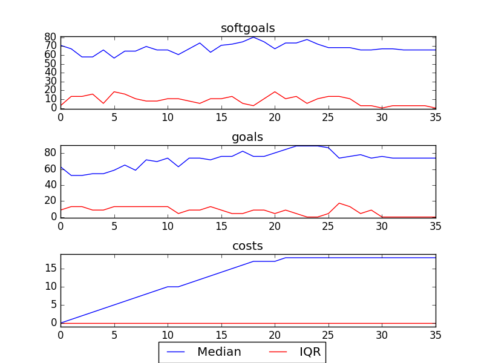

## CSITDepartment
```

rank ,         name ,    med   ,   iqr 
----------------------------------------------------
   1 ,      gen0_f1 ,     20.0  ,    3.0 (-------        |  *---        ),18.00, 20.00, 23.00, 23.00, 24.00
   1 ,      gen2_f1 ,     23.0  ,    2.0 (       ------- |      *---    ),20.00, 22.00, 24.00, 24.00, 25.00
   2 ,      gen4_f1 ,     24.0  ,    1.0 (              -|------    *   ),22.00, 24.00, 25.00, 25.00, 25.00
   2 ,      gen6_f1 ,     24.0  ,    1.0 (               |          *   ),24.00, 24.00, 25.00, 25.00, 25.00
   3 ,      gen8_f1 ,     26.0  ,    1.0 (               |      ----   *),24.00, 25.00, 26.00, 26.00, 26.00
   3 ,     gen10_f1 ,     26.0  ,    1.0 (               |      ----   *),24.00, 25.00, 26.00, 26.00, 26.00

rank ,         name ,    med   ,   iqr 
----------------------------------------------------
   1 ,      gen0_f2 ,     11.0  ,    3.0 (         *     |-------       ), 8.00,  8.00, 11.00, 13.00, 15.00
   1 ,      gen2_f2 ,     13.0  ,    3.0 (      ---      |   *   ---    ),10.00, 11.00, 14.00, 15.00, 16.00
   2 ,      gen4_f2 ,     14.0  ,    1.0 (      ---------|---    *  --- ),10.00, 14.00, 15.00, 16.00, 17.00
   2 ,      gen6_f2 ,     16.0  ,    1.0 (             --|-------   *   ),12.00, 15.00, 16.00, 17.00, 17.00
   2 ,      gen8_f2 ,     16.0  ,    2.0 (               |             *),15.00, 15.00, 17.00, 17.00, 17.00
   2 ,     gen10_f2 ,     17.0  ,    2.0 (               |             *),15.00, 15.00, 17.00, 17.00, 17.00
```

### Time Taken : 2.65573787689


### Decisions Ranked
```
+------+-------------------------------------------------------------+----------+-------+------+---------+
| rank |                             name                            |   type   | value | cost | support |
+------+-------------------------------------------------------------+----------+-------+------+---------+
|  1   |             !Calls Be Recorded into a Data Base1            |   goal   |   1   |  1   | 0.00993 |
|  2   |         *IT Providers have Knowledge of Counselling         |   goal   |   1   |  1   | 0.00922 |
|  3   |               *Implement Email for Counsellors              |   task   |   1   |  1   | 0.00806 |
|  4   |  *IT Providers have Knowledge of Fundraising and Marketing  |   goal   |   1   |  1   | 0.00645 |
|  5   |               !A Training Computer Be Present1              |   goal   |   1   |  1   | 0.00614 |
|  6   |         Consideration of Feedback [from Counsellors]        | softgoal |   1   |  1   | 0.00614 |
|  7   |                        Free Upgrades                        | resource |   1   |  1   | 0.00587 |
|  8   |                      Use Current Method                     |   task   |   1   |  1   | 0.00587 |
|  9   |                         Network PCs                         |   task   |   1   |  1   | 0.00561 |
|  10  |  !Performance Review Information Be Collected in Data Base1 |   goal   |   1   |  1   | 0.00561 |
|  11  |                           Use VPN                           |   task   |   -1  |  1   | 0.00538 |
|  12  |                  Put Content Onto Website1                  |   task   |   1   |  1   | 0.00516 |
|  13  |                            Use T1                           |   task   |   1   |  1   | 0.00516 |
|  14  |             Improve [Call Recording Equipment]1             | softgoal |   1   |  1   | 0.00496 |
|  15  |                  !An IT Trainer Be Present1                 |   goal   |   1   |  1   | 0.00496 |
|  16  |           Adequately Customizable [CS Technology]           | softgoal |   1   |  1   | 0.00496 |
|  17  |                     CS Be Not for Profit                    |   goal   |   1   |  1   |  0.0043 |
|  18  |          Easily Accessable Technology Instructions1         | softgoal |   1   |  1   | 0.00416 |
|  19  |                         IT Resources                        | resource |   -1  |  1   | 0.00416 |
|  20  |                            Oracle                           | resource |   -1  |  1   | 0.00416 |
|  21  |    Call Center Server and Scheduling System Be Integrated   |   goal   |   1   |  1   | 0.00416 |
|  22  |                       Free Web Server                       | resource |   -1  |  1   | 0.00416 |
|  23  |                        Free Software                        | resource |   -1  |  1   | 0.00416 |
|  24  | Increased Emphasis on IT in Hiring Process [of Counsellors] | softgoal |   -1  |  1   | 0.00416 |
|  25  |              Decrease Clumsiness [Technology]1              | softgoal |   -1  |  1   | 0.00416 |
|  26  |                        Free Hardware                        | resource |   -1  |  1   | 0.00416 |
|  27  |                    Increase IT Resources1                   | softgoal |   -1  |  1   | 0.00416 |
|  28  |                           Software                          | resource |   -1  |  1   | 0.00416 |
|  29  |                         Web Server1                         | resource |   -1  |  1   | 0.00416 |
|  30  |                           Hardware                          | resource |   -1  |  1   | 0.00416 |
|  31  |                           Upgrades                          | resource |   -1  |  1   | 0.00416 |
|  32  |        Perform Donor/Accounting Data Base Maintenance       |   task   |   -1  |  1   | 0.00416 |
|  33  |               Provide Online Donor Technology1              |   task   |   -1  |  1   | 0.00416 |
|  34  |       Provide Technology to Create and Send Documents       |   task   |   -1  |  1   | 0.00323 |
|  35  |            Use Informal Buddy System for Training           |   task   |   -1  |  1   |  0.0023 |
|  36  |                  !Implement Phone Feedback1                 |   task   |   -1  |  1   | 0.00215 |
+------+-------------------------------------------------------------+----------+-------+------+---------+
```
