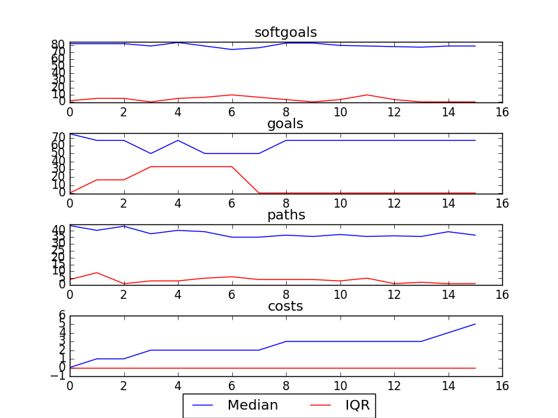

## CSSAProgram
```

rank ,         name ,    med   ,   iqr 
----------------------------------------------------
   1 ,      gen0_f1 ,    72.13  ,    0.0 (---------------|---------*--  ),34.43, 72.13, 72.13, 73.77, 77.05
   1 ,      gen2_f1 ,    77.05  ,   3.28 (---------------|----------  * ),34.43, 73.77, 77.05, 77.05, 77.05
   1 ,      gen4_f1 ,    77.05  ,    0.0 (               |      ------* ),67.21, 77.05, 77.05, 77.05, 78.69
   1 ,      gen6_f1 ,    77.05  ,    0.0 (               |      ------* ),67.21, 77.05, 77.05, 78.69, 78.69
   1 ,      gen8_f1 ,    77.05  ,   1.64 (               |             *),77.05, 77.05, 78.69, 78.69, 78.69
   1 ,     gen10_f1 ,    78.69  ,   1.64 (               |             *),77.05, 77.05, 78.69, 78.69, 78.69

rank ,         name ,    med   ,   iqr 
----------------------------------------------------
   1 ,      gen0_f2 ,    66.67  ,    0.0 (---------------|-------------*),16.67, 66.67, 66.67, 66.67, 66.67
   1 ,      gen2_f2 ,    66.67  ,    0.0 (---------------|-------------*),16.67, 66.67, 66.67, 66.67, 66.67
   1 ,      gen4_f2 ,    66.67  ,    0.0 (               |             *),66.67, 66.67, 66.67, 66.67, 66.67
   1 ,      gen6_f2 ,    66.67  ,    0.0 (               |             *),66.67, 66.67, 66.67, 66.67, 66.67
   1 ,      gen8_f2 ,    66.67  ,    0.0 (               |             *),66.67, 66.67, 66.67, 66.67, 66.67
   1 ,     gen10_f2 ,    66.67  ,    0.0 (               |             *),66.67, 66.67, 66.67, 66.67, 66.67
```

### Time Taken : 1.56440806389


### Decisions Ranked
```
+------+---------------------------------------------+----------+-------+------+---------+
| rank |                     name                    |   type   | value | cost | support |
+------+---------------------------------------------+----------+-------+------+---------+
|  1   |              Attend SA Meetings             |   task   |   1   |  1   | 0.02139 |
|  2   |              Plan Social Events             |   task   |   -1  |  1   | 0.02139 |
|  3   |          Run Fundraiser in Schools1         |   task   |   1   |  1   |  0.0181 |
|  4   |                  Train SA s                 |   task   |   -1  |  1   | 0.01569 |
|  5   |        School Initiates Presenation1        |   task   |   -1  |  1   | 0.01384 |
|  6   |           Increased SA Resources1           | softgoal |   -1  |  1   | 0.01384 |
|  7   |    Permission for Presentations Be Given    |   goal   |   -1  |  1   | 0.01384 |
|  8   | Kids Be Used to Communicate with Other Kids |   goal   |   1   |  1   | 0.01384 |
|  9   |               Send out Emails               |   task   |   -1  |  1   | 0.01384 |
|  10  |           Help with Presentations           |   task   |   -1  |  1   | 0.01384 |
|  11  |             Promotion Resources1            | resource |   -1  |  1   | 0.01384 |
|  12  |         Write Articles for Newspaper        |   task   |   -1  |  1   | 0.01384 |
|  13  |          Positive Reputation [CS]1          | softgoal |   -1  |  1   | 0.01384 |
|  14  |                 Retrain SA s                |   task   |   1   |  1   |  0.0098 |
|  15  |               Provide Speaches              |   task   |   1   |  1   |  0.0084 |
|  16  |              Attend CS Meetings             |   task   |   -1  |  1   | 0.00735 |
+------+---------------------------------------------+----------+-------+------+---------+
```
