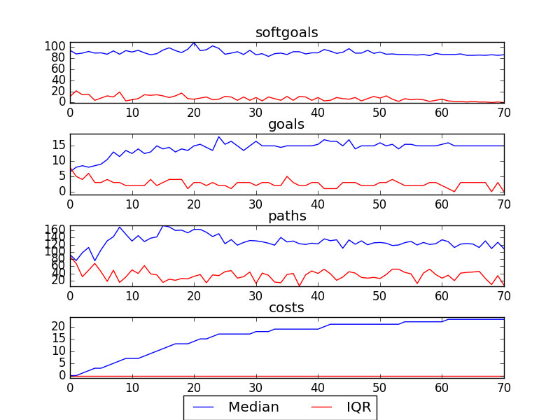

## CSServices
```

rank ,         name ,    med   ,   iqr 
----------------------------------------------------
   1 ,      gen0_f1 ,     76.0  ,    2.0 (--     *       |              ),74.00, 75.00, 77.00, 79.00, 79.00
   1 ,      gen2_f1 ,     79.0  ,    1.0 (  ----------  *|   --------   ),75.00, 79.00, 80.00, 82.00, 85.00
   2 ,      gen4_f1 ,     80.0  ,    6.0 (            -- |             *),79.00, 80.00, 86.00, 86.00, 86.00
   2 ,      gen6_f1 ,     86.0  ,    6.0 (               |             *),80.00, 80.00, 86.00, 86.00, 86.00
   2 ,      gen8_f1 ,     86.0  ,    0.0 (              -|-------------*),80.00, 86.00, 86.00, 86.00, 86.00
   2 ,     gen10_f1 ,     86.0  ,    0.0 (               |             *),86.00, 86.00, 86.00, 86.00, 86.00

rank ,         name ,    med   ,   iqr 
----------------------------------------------------
   1 ,      gen0_f2 ,      5.0  ,    1.0 (  *--          |              ), 5.00,  5.00,  6.00,  6.00,  7.00
   2 ,      gen2_f2 ,      6.0  ,    1.0 (--   *         |       ---    ), 5.00,  6.00,  7.00, 13.00, 14.00
   2 ,      gen4_f2 ,      7.0  ,    6.0 (  ---          |       *  --- ), 6.00,  7.00, 13.00, 14.00, 15.00
   3 ,      gen6_f2 ,     14.0  ,    8.0 (  ---          |             *), 6.00,  7.00, 15.00, 15.00, 15.00
   3 ,      gen8_f2 ,     15.0  ,    1.0 (     ----------|----------   *), 7.00, 14.00, 15.00, 15.00, 15.00
   3 ,     gen10_f2 ,     15.0  ,    0.0 (               |             *),15.00, 15.00, 15.00, 15.00, 15.00
```

### Time Taken : 36.6932959557


### Decisions Ranked
```
+------+------------------------------------------------------------+----------+-------+------+---------+
| rank |                            name                            |   type   | value | cost | support |
+------+------------------------------------------------------------+----------+-------+------+---------+
|  1   |                         Web Server                         | resource |   -1  |  1   | 0.00521 |
|  2   |                  Create Counselling Posts                  |   task   |   1   |  1   | 0.00417 |
|  3   |     Implement Bulletin Board with Delayed Moderation1      |   task   |   1   |  1   | 0.00347 |
|  4   |             !Implement One-On-One Chat Rooms1              |   task   |   1   |  1   | 0.00321 |
|  5   |               *Maintain PHL Phone Services4                |   task   |   -1  |  1   | 0.00321 |
|  6   |    Inform Kids about Anonymity [Kids] of Web Services1     |   task   |   1   |  1   | 0.00298 |
|  7   |                Implement Voice Counselling1                |   task   |   1   |  1   | 0.00298 |
|  8   |                Provide Written Counselling                 |   task   |   1   |  1   | 0.00298 |
|  9   |                   Service Levels Be Met                    |   goal   |   1   |  1   | 0.00278 |
|  10  |             Provide Web Counselling with Audio             |   task   |   -1  |  1   |  0.0026 |
|  11  |           Implement Bulletin Board with Replies1           |   task   |   -1  |  1   |  0.0026 |
|  12  |             Web Site Content Be Updated Daily              |   goal   |   1   |  1   |  0.0026 |
|  13  |                 !Implement Text Messaging1                 |   task   |   1   |  1   |  0.0026 |
|  14  |                !Moderate Discussion Boards                 |   task   |   1   |  1   | 0.00231 |
|  15  |                  Decrease Response TIme4                   | softgoal |   1   |  1   | 0.00231 |
|  16  |        Only Online Request from Canadians Accepted         |   goal   |   1   |  1   | 0.00219 |
|  17  |                         Feedback1                          | resource |   1   |  1   | 0.00219 |
|  18  |             Maintain Ask a Counsellor Section1             |   task   |   -1  |  1   | 0.00189 |
|  19  |              Kids Have Ownership of Services6              | softgoal |   -1  |  1   | 0.00181 |
|  20  |  Answer 80% of Calls within 30 Seconds of Message Ending   |   goal   |   1   |  1   | 0.00174 |
|  21  |                  Increase Web Resources2                   | softgoal |   1   |  1   | 0.00174 |
|  22  |           Kids Use Cyber Café/Portal/Chat Room1            |   task   |   -1  |  1   | 0.00174 |
|  23  |                    Strategic Blue Print                    | resource |   1   |  1   | 0.00174 |
|  24  |                   Services Be Bilingual1                   |   goal   |   1   |  1   | 0.00174 |
|  25  |             *Sufficient Counselling Resources1             | softgoal |   -1  |  1   | 0.00174 |
|  26  |                 !Implement Phone Feedback3                 |   task   |   -1  |  1   | 0.00174 |
|  27  |                Kids Use Phone Counselling1                 |   task   |   -1  |  1   | 0.00174 |
|  28  |                      Web Site Content                      | resource |   -1  |  1   | 0.00174 |
|  29  |             Provide Web Counselling with Video             |   task   |   -1  |  1   | 0.00174 |
|  30  |                Effective Chat Room Filters                 | softgoal |   1   |  1   | 0.00174 |
|  31  |                Kids Use Email Counselling1                 |   task   |   -1  |  1   | 0.00174 |
|  32  |                      Implement Delay                       |   task   |   -1  |  1   | 0.00174 |
|  33  |              Implement Anti-Pranking Message               |   task   |   1   |  1   | 0.00174 |
|  34  |                   Feedback Form Software                   | resource |   -1  |  1   | 0.00174 |
|  35  |              Schedule Chat at Specific Times               |   task   |   -1  |  1   | 0.00174 |
|  36  |          Kids Read General Questions and Answers1          |   task   |   -1  |  1   | 0.00174 |
|  37  |  !Implement\nTool to Allow Parents to Talk to Each Other   |   task   |   -1  |  1   | 0.00174 |
|  38  |               Voice Counselling be Performed               |   task   |   -1  |  1   | 0.00174 |
|  39  |         Kids use get Informed Section of Web Site          |   task   |   -1  |  1   | 0.00174 |
|  40  |                 !Perform Email Counselling                 |   task   |   -1  |  1   | 0.00174 |
|  41  |         Increase Emphasis on Online Feedback Form1         | softgoal |   1   |  1   | 0.00174 |
|  42  |               Increase Resources [Services]1               | softgoal |   1   |  1   | 0.00174 |
|  43  |       Block Kids who Display Inappropriate Behavoir        |   task   |   -1  |  1   | 0.00174 |
|  44  |                          Feedback                          | resource |   -1  |  1   | 0.00174 |
|  45  |               Implement Information Section                |   task   |   -1  |  1   | 0.00174 |
|  46  |                !Kids Read Polls about Kids1                |   task   |   -1  |  1   | 0.00174 |
|  47  |                     Reduce Prank Calls                     | softgoal |   -1  |  1   | 0.00174 |
|  48  |                        Web Software                        | resource |   -1  |  1   | 0.00174 |
|  49  |              Parents Use Information Section1              |   task   |   -1  |  1   | 0.00174 |
|  50  |                Avoid Presence of Pedofiles1                | softgoal |   -1  |  1   | 0.00174 |
|  51  |                  Web Services Self Serve3                  | softgoal |   -1  |  1   | 0.00174 |
|  52  |                  Increase Phone Resources                  | softgoal |   -1  |  1   | 0.00174 |
|  53  |           Counsellors Be Professionally Trained1           |   goal   |   -1  |  1   | 0.00174 |
|  54  |                        Trace Calls                         |   task   |   1   |  1   | 0.00174 |
|  55  |                 *Provide Recorded Messages                 |   task   |   -1  |  1   | 0.00174 |
|  56  |                 Put Content Onto Website1                  |   task   |   -1  |  1   | 0.00174 |
|  57  |                Kids Use Video Counselling1                 |   task   |   -1  |  1   | 0.00174 |
|  58  |                   Confidentiality [Kids]                   | softgoal |   -1  |  1   | 0.00174 |
|  59  |                Implement Board with Replies                |   task   |   -1  |  1   | 0.00174 |
|  60  |                Kids Use Voice Counselling1                 |   task   |   -1  |  1   | 0.00174 |
|  61  |                     Service Resources                      | resource |   1   |  1   | 0.00174 |
|  62  |           Telephony Be Implemented and Managed1            |   goal   |   -1  |  1   | 0.00174 |
|  63  |                     Implement Filters                      |   task   |   -1  |  1   | 0.00174 |
|  64  |                  Relevance in Kids Lives2                  | softgoal |   -1  |  1   | 0.00174 |
|  65  |                      !Moderate a Chat                      |   task   |   -1  |  1   | 0.00174 |
|  66  | Parents Use\nTool to Allow Parents to Talk to Each Other 1 |   task   |   -1  |  1   | 0.00174 |
|  67  |             Correct Interpretation of Counsel1             | softgoal |   -1  |  1   | 0.00174 |
|  68  |           Kids Use Ask a Counsellor Section\ns1            |   task   |   -1  |  1   | 0.00174 |
|  69  |          Parents Use Bulletin Board with Replies1          |   task   |   -1  |  1   | 0.00174 |
|  70  |      Kids Use Bulletin Board with Delayed Moderation1      |   task   |   -1  |  1   | 0.00174 |
|  71  |           Kids Use Bulletin Board with Replies1            |   task   |   -1  |  1   | 0.00174 |
+------+------------------------------------------------------------+----------+-------+------+---------+
```
