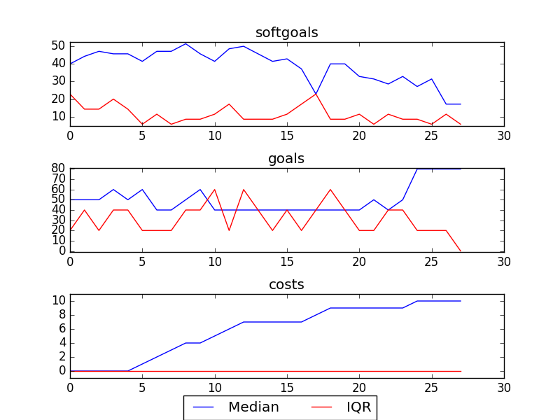
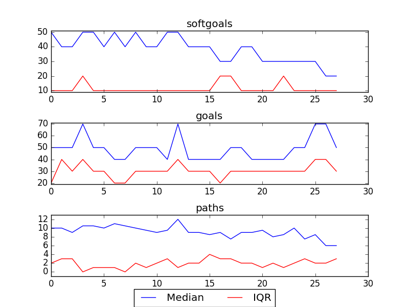

## Kids and Youth
```

rank ,         name ,    med   ,   iqr 
----------------------------------------------------
   1 ,      gen0_f1 ,    17.14  ,   5.72 (               |             *),17.14, 17.14, 22.86, 22.86, 22.86
   1 ,      gen2_f1 ,    22.86  ,    0.0 (---------------|-------------*),17.14, 22.86, 22.86, 22.86, 22.86
   1 ,      gen4_f1 ,    22.86  ,    0.0 (               |             *),22.86, 22.86, 22.86, 22.86, 22.86
   1 ,      gen6_f1 ,    22.86  ,    0.0 (               |             *),22.86, 22.86, 22.86, 22.86, 22.86
   1 ,      gen8_f1 ,    22.86  ,    0.0 (               |             *),22.86, 22.86, 22.86, 22.86, 22.86
   1 ,     gen10_f1 ,    22.86  ,    0.0 (               |             *),22.86, 22.86, 22.86, 22.86, 22.86

rank ,         name ,    med   ,   iqr 
----------------------------------------------------
   1 ,      gen0_f2 ,    100.0  ,    0.0 (*              |              ),100.00, 100.00, 100.00, 100.00, 100.00
   1 ,      gen2_f2 ,    100.0  ,    0.0 (*              |              ),100.00, 100.00, 100.00, 100.00, 100.00
   1 ,      gen4_f2 ,    100.0  ,    0.0 (*              |              ),100.00, 100.00, 100.00, 100.00, 100.00
   1 ,      gen6_f2 ,    100.0  ,    0.0 (*              |              ),100.00, 100.00, 100.00, 100.00, 100.00
   1 ,      gen8_f2 ,    100.0  ,    0.0 (*              |              ),100.00, 100.00, 100.00, 100.00, 100.00
   1 ,     gen10_f2 ,    100.0  ,    0.0 (*              |              ),100.00, 100.00, 100.00, 100.00, 100.00
```

### Smoothened Plot


### Decisions Ranked
```
+------+-------------------------------------------+----------+-------+------+---------+
| rank |                    name                   |   type   | value | cost | support |
+------+-------------------------------------------+----------+-------+------+---------+
|  1   |        Implement Video Counselling        |   task   |   -1  |  1   | 0.05556 |
|  2   |        Implement Voice Counselling        |   task   |   -1  |  1   | 0.03704 |
|  3   |         Maintain Phone Counselling        |   task   |   -1  |  1   | 0.02778 |
|  4   |         !Implement Text Messaging         |   task   |   -1  |  1   | 0.02778 |
|  5   |  !Implement General Questions and Answers |   task   |   1   |  1   | 0.02222 |
|  6   |      !Implement One-On-One Chat Rooms     |   task   |   1   |  1   | 0.02222 |
|  7   |   !Implement Cyber Café/Portal/Chat Room  |   task   |   1   |  1   | 0.01852 |
|  8   | Maintain Get Informed Section of Web Site |   task   |   1   |  1   | 0.01852 |
|  9   |        !Implement Polls about Kids        |   task   |   -1  |  1   | 0.01852 |
|  10  |        Implement Email Counselling        |   task   |   1   |  1   | 0.01587 |
|  11  |     Maintain Ask a Counsellor Section     |   task   |   1   |  1   | 0.01587 |
|  12  |   !Implement Bulletin Board with Replies  |   task   |   1   |  1   | 0.01389 |
|  13  |            Patient [Counselor]            | softgoal |   -1  |  1   | 0.01235 |
|  14  |        Confidentiality [Services]         | softgoal |   -1  |  1   | 0.01235 |
|  15  |           Friendly [Web site] 1           | softgoal |   -1  |  1   | 0.01235 |
|  16  |          High Quality [Services]          | softgoal |   -1  |  1   | 0.01235 |
|  17  |      Connect Back to the Community 1      | softgoal |   1   |  1   | 0.01235 |
|  18  |   Similarity with other kids  problems    | softgoal |   1   |  1   | 0.01235 |
|  19  |       Ownership of Services [Kids]        | softgoal |   -1  |  1   | 0.01235 |
|  20  |          Availability [Services]          | softgoal |   -1  |  1   | 0.01235 |
|  21  |      Decrease [Phone Waiting Time] 1      | softgoal |   -1  |  1   | 0.01235 |
|  22  |              Provide Feedback             |   task   |   -1  |  1   | 0.01235 |
|  23  |           Anonymity [Services]            | softgoal |   -1  |  1   | 0.01235 |
|  24  |             Services Be Free1             |   goal   |   1   |  1   | 0.01235 |
|  25  |         Connect with Other Kids 1         | softgoal |   -1  |  1   | 0.01235 |
|  26  |           Immediacy [Services]            | softgoal |   -1  |  1   | 0.01235 |
|  27  |       Easy [Access to Post Reply] 1       | softgoal |   -1  |  1   | 0.01235 |
|  28  |      Be informed of service anonymity     |   goal   |   1   |  1   | 0.01235 |
+------+-------------------------------------------+----------+-------+------+---------+
```

### Time Taken : 1.95950698853
